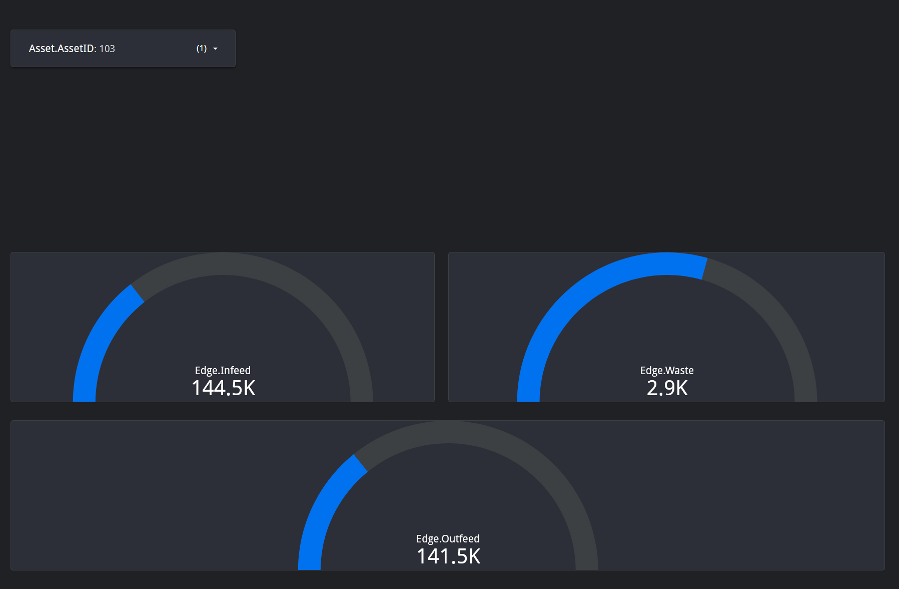

# UNS Demo

This repository is a personal project intended for individuals getting started with the UNS, especially those looking for hands-on examples that demonstrate the interactions between tools in a modern industrial stack.

The setup is **not production-ready**. It was built for my own exploration and learning, with a focus on staying as close to production patterns as possible, though in some cases, compromises were made for simplicity or speed.

Throughout the guide, I’ve included links to relevant products, documentation, or articles when appropriate. At the end of the README, you’ll also find a dedicated section titled **Learning & References**. A list of videos, tutorials, and training materials I found helpful during this journey.

>You do **not** need to implement every component shown here. Pick and choose what fits your use case.

If you run into trouble or have questions, feel free to reach out.


---

## Project Overview

This project simulates a multi-tiered Unified Namespace (UNS) architecture using a variety of modern industrial technologies. The goal is to gain practical, hands-on experience with tools commonly used in production environments, while keeping the implementation modular and easy to adapt or simplify for different use cases.

To support this, the stack includes:

- **Mosquitto** (local MQTT broker) and **HiveMQ Cloud** (cloud-hosted MQTT broker) for UNS data transport

- **Ignition** gateways (frontend and backend) for **Sparkplug B** enablement, edge simulation, contextualization, and structured data modeling

- **Node-RED** for message transformation and routing to cloud services

- **Python** service for querying MySQL and publishing schedule data to MQTT

- **TimeBase** historian stack for time-series storage, visualization, and analysis

- **Google BigQuery** and **Looker Studio** integrations for cloud-based analytics and dashboards


---
### Terms & Definitions

Here are some commonly used terms referenced throughout this project:

- **MQTT**: A lightweight publish/subscribe messaging protocol ideal for IIoT.

- **Sparkplug B**: A specification that defines how MQTT messages can encode industrial data in a structured and auto-discoverable way.

- **Unified Namespace (UNS)**: A centralized structure for organizing and sharing real-time industrial data.

- **Ignition**: A SCADA/IIoT platform by Inductive Automation used here for backend and frontend data gateways.

- **MQTT Engine**: Cirrus Link module for subscribing to MQTT topics and displaying them in Ignition.

- **MQTT Transmission**: Cirrus Link module for publishing Ignition tag values to MQTT.

- **Node-RED**: A low-code platform used for routing and transforming MQTT messages, especially for cloud ingestion.

- **Timebase**: A high-performance, open-source historian used to capture time-series data from the UNS.

- **JSON Payload**: Data encoded in JSON format, used for sending messages between services.

- **Contextualized Data**: Structured data that contains metadata or hierarchy information (e.g., asset, line, site) to give it meaning within a system.
---
## Prerequisites

Before getting started, make sure the following tools are installed on your system:

- **Docker Desktop**  
  - Docker allows you to run lightweight, isolated application environments called **containers**. This project relies on Docker to simulate a full industrial stack, without needing to install each tool manually on your machine! 
  - [Docker Desktop](https://www.docker.com/products/docker-desktop) is available for Windows and macOS and includes everything you need to get started.

- **Docker Compose**
  - [Docker Compose](https://docs.docker.com/compose/) is a tool that lets you define and manage multi-container applications using a single configuration file (`docker-compose.yml`). Instead of starting each container manually, Compose allows you to spin up the entire environment with a single command. It’s especially useful for orchestrating complex setups like this one, where many tools need to communicate across networks, ports, and volumes.


Optional / External Services:

- **Google Cloud Account** (BigQuery & Looker Studio)  
  - A [free tier](https://cloud.google.com/free) is available. Required if you want to explore the cloud reporting and analytics integration.
- **HiveMQ Cloud Account** (optional)  
  - You can connect to [HiveMQ Cloud](https://www.hivemq.com/mqtt-cloud-broker/) instead of running your own MQTT broker. Requires basic setup and credentials.
- **Ignition by Inductive Automation**  
  - You do **not** need to create an account to download Ignition or its modules.  
  On the [Ignition Downloads page](https://inductiveautomation.com/downloads/ignition), look for the small **"Skip form and download directly"** link just below the sign-up form. This lets you access everything needed for local development and evaluation, including trial licenses and module downloads.

- **Cirrus Link MQTT Modules**  
  - **MQTT Engine** and **MQTT Transmission** are used in this project.  
  You can download these modules from the [Inductive Automation Third-Party Modules page](https://inductiveautomation.com/downloads/third-party-modules/8.1.48), under the Cirrus Link Solutions MQTT Modules for Ignition section.

- **MQTT Explorer (Beta)** – Helpful for inspecting MQTT messages and topics.
    - The [official release](https://mqtt-explorer.com/) does not support Sparkplug B decoding, which can make payloads unreadable.
    - Instead, download the [beta version (v0.4.0-beta4)](https://github.com/thomasnordquist/MQTT-Explorer/releases/download/0.4.0-beta4/MQTT-Explorer-0.4.0-beta4.exe) from GitHub, which includes Sparkplug B support and correctly decodes payloads for inspection.

>  **Note:** You are not required to implement every component. You can simplify the architecture. For example, by running a single Ignition gateway or omitting the cloud broker.

---

### Getting Started

Before launching the stack, make sure **Docker Desktop** is running. It includes the **Docker Engine** that powers containers behind the scenes—if it's not running, the commands below will **fail**.

Once it’s running, open a **terminal** and navigate to the **root** of this repository. Then run: `docker compose up -d`

This will start all services defined in the docker-compose.yml file in detached mode. The stack includes Ignition gateways, Mosquitto, Node-RED, TimeBase, the Python SQL-to-MQTT service, and other components. It may take a few minutes for everything to fully initialize the first time.

You can monitor container status with: `docker compose ps`

Or follow logs in real time with: `docker compose logs -f`

>If you ever need to shut everything down, use docker compose down.

---

### Backend Gateways (Spokes)

The backend Ignition gateways act as **spokes** in the hub-and-spoke UNS architecture. They are positioned logically at the "edge" of the system, close to the data sources such as PLCs or smart devices, but are built using **full Ignition Standard Edition gateways** (not Ignition Edge).

### Responsibilities
- Simulate connectivity to field equipment
- Host local tag providers and optionally execute scripts or logic
- **Contextualize edge data** by organizing it into structured tag models (e.g., by asset, line, or area)
- Use **MQTT Transmission** (Cirrus Link) to publish tag data upstream via Sparkplug B

### Under the Hood: Key Setup Notes

This section highlights important configuration details for this part of the stack. It’s **not an exhaustive step-by-step**, but should help clarify how the system is wired up behind the scenes, especially if you plan to expand or customize the setup.

---

##### MQTT Transmission Setup

- The **MQTT Transmission** module must be installed on each backend Ignition gateway.
- This is handled automatically via the `volumes:` block in `docker-compose.yml`:
  ```yaml
  ./ignition-modules/MQTT-Transmission-signed.modl:/usr/local/bin/ignition/user-lib/modules/MQTT-Transmission-signed.modl

- On first launch, visit Config → Modules in the Gateway Web UI and scroll to the **Cirrus Link Solutions LLC** section. You’ll need to accept the module certificate before the module becomes active.

##### Tag Structure & Simulation Logic

- Inside the Ignition Designer, tags have been organized under a PressArea tag provider to contextualize edge data before it’s transmitted to the broker.

- A simulation tag is included in each gateway (based on an approach shared in a training course). 
    - Simulates values across the tag tree.
    - Builds a BigQuery-compatible payload.
    - Publishes this JSON into the BigQuery namespace.

- You can customize or replace this simulation method to better fit your own use case.


##### MQTT Transmission Configuration

- Go to Config → MQTT Transmission → Servers in the Gateway UI.

- This is where you define the MQTT broker connection (e.g., Mosquitto).
    - Enter the broker URL.
    - Provide username/password credentials if using authentication.


- Under the Transmitter tab:
    - Specify which tag provider(s) to publish.
    - In this demo, the entire PressArea tag tree is transmitted.
    - A generic Group ID and Edge Node ID are used, since these will be abstracted once data reaches the frontend gateway.
        - I recommend reading [MQTT Transmission Transmitters and Tag Trees](https://docs.chariot.io/display/CLD80/MQTT+Transmission+Transmitters+and+Tag+Trees).


---
## Frontend Gateway

The frontend Ignition gateway serves as the **hub** in this hub-and-spoke architecture. It aggregates industrial data from multiple backend gateways and services into a single, browsable UNS.

### Responsibilities
- Hosts the **MQTT Engine Module** and **MQTT Transmission Module**, both from Cirrus Link.
- Subscribes to Sparkplug B payloads published by the backend gateways.
- Uses the UNS Tags feature (introduced in MQTT Engine v4.0.23) to automatically flatten Sparkplug metrics into a structured tag hierarchy, organized under a dedicated folder within the `[MQTT Engine]` tag provider
- Exposes the Unified Namespace to tools like Timebase, Node-RED, and cloud integrations.

### Why the Gateway Network Exists (But Isn’t Used for Tag Sharing)

Although the Ignition **Gateway Network** is set up between the backend and frontend gateways in this project, it is not used for **tag communication**.

Instead, this architecture uses **Sparkplug B over MQTT**(via the Cirrus Link modules) as the primary mechanism for publishing and subscribing to data between gateways. Each backend publishes its data to a MQTT broker, and the frontend gateway subscribes to that broker, automatically discovering and organizing the data in real time using the **MQTT Engine** module.

This design enables:
- **Decoupled Architecture**: Gateways don’t rely on direct tag access or tight coupling.
- **Scalability**: New gateways can join by simply publishing to the broker.
- **Resilience**: Backend systems can operate independently, even if the frontend is unavailable.
- **UNS Consistency**: Data flows through a single namespace model rather than point-to-point links.

### Data Aggregation & Namespace Layout

The frontend Ignition gateway acts as the primary subscriber to the on-prem Mosquitto MQTT broker. This allows it to automatically discover and display all incoming data from:
- The Press and Print backend Ignition gateways, which publish via Sparkplug B.
- The Python SQL container, which publishes flat JSON schedule data.

Thanks to the MQTT Engine module and proper namespace configuration, this incoming data is **automatically** organized into a clean, contextual UNS structure. This makes the frontend gateway an accurate real-time digital twin of operations.

Once structured, the entire UNS can be transmitted upstream to a cloud broker for external consumers or analytics tools to access.

>The screenshot below shows how the frontend gateway renders the tag tree. You can see both Press and Print data models side-by-side, as well as the injected schedule from the sqltojson container, all organized within the same namespace:


### Under the Hood: Key Setup Notes

This section highlights important configuration details for this part of the stack. It’s **not an exhaustive step-by-step**, but should help clarify how the system is wired up behind the scenes, especially if you plan to expand or customize the setup.

##### MQTT Transmission & Engine Setup

- Both the MQTT Engine and MQTT Transmission modules (Cirrus Link) are installed automatically via the `volumes:` block in `docker-compose.yml`:

     ```yaml
    ./ignition-modules/MQTT-Transmission-signed.modl:/usr/local/bin/ignition/user-lib/modules/MQTT-Transmission-signed.modl
    ./ignition-modules/MQTT-Engine-signed.modl:/usr/local/bin/ignition/user-lib/modules/MQTT-Engine-signed.modl

- On first launch, visit Config → Modules in the Gateway Web UI and scroll to the Cirrus Link Solutions LLC section. Accept the certificate(s) to activate the modules.

##### MQTT Engine Configuration (Inbound Data)

- Broker Connection
    - Navigate to Config → MQTT Engine → Servers.
    - Configure a connection to the on-prem Mosquitto broker.
    - This broker receives Sparkplug B and flat MQTT data.

- Sparkplug B → UNS Mapping
    - Go to Namespaces → Default → Sparkplug B.
        - Enable the **UNS Tags** option (available in MQTT Engine v4.0.23+). This creates a browsable tag tree based on metric paths, automatically placing Sparkplug B metrics under a dedicated folder in the `[MQTT Engine]` provider.
        - (Optional) enable **Include Default Tag Providers** to retain the full Sparkplug hierarchy under `[MQTT Engine]/Edge Nodes`, in addition to the flattened UNS view.

- Flat JSON → Custom Namespace
    - Still under Namespaces, go to the Custom tab.
        - Add a custom namespace that listens to MQTT topics from services like sqltojson.
        - This allows JSON payloads (e.g., job schedules) to appear in the UNS alongside Sparkplug tags.


##### MQTT Transmission Configuration (Outbound Data)

The frontend gateway also publishes data to a cloud-hosted MQTT broker (e.g., HiveMQ) using its MQTT Transmission module.

- Cloud Broker Setup
    - Go to Config → MQTT Transmission → Servers.
        - Add the HiveMQ Cloud broker details.
            - You'll need to provide username and password from your HiveMQ Cloud portal.
        - Test your connection after saving.


- UNS Publisher Setup
    - Under the UNS Transmitter tab:
        - Select the tag providers or folders to publish (e.g., the entire [MQTT Engine]/UNS folder).
            - This ensures everything visible in your frontend gateway’s UNS is pushed to the cloud broker for visualization or downstream processing.
            - This setup enables the frontend gateway to act as the single source of truth, ingesting, transforming, and forwarding industrial data.

---
## MQTT Payloads and Data Modeling

This system uses two primary formats to move data across the UNS, **Sparkplug B** and **Flat JSON**. Each format plays a different role depending on the source and destination of the data.

### Sparkplug B (Gateway-to-Gateway Communication)

Used for structured, auto-discoverable tag data from Ignition gateways. Backend (spoke) gateways publish tag values to the broker using Sparkplug B via the **MQTT Transmission** module. The frontend (hub) gateway uses the **MQTT Engine** module to subscribe to and interpret these messages.

#### Topic Format
Sparkplug B topics follow a strict structure:`spBv1.0/<Group_ID>/<Message_Type>/<Edge_Node_ID>[/<Device_ID>]`


Examples:
- `spBv1.0/FortMill/NBIRTH/Press103`
- `spBv1.0/FortMill/DDATA/Press103/Motor01`

The MQTT Engine module automatically transforms Sparkplug B payloads into a browsable tag tree under the `[MQTT Engine]` tag provider in Ignition.

This format is especially suited for gateway-to-gateway communication and systems that rely on structured tags and auto-discovery.

#### Considerations with ISA-95

While Sparkplug B is powerful, it's not a perfect fit for all aspects of ISA-95 modeling, particularly when trying to align MQTT topics directly with an ISA-95 equipment hierarchy. Sparkplug B enforces its own topic structure, which can limit how flexibly you apply ISA-95 across the Unified Namespace.

As Corso Systems points out in their article, [Combining the Power of ISA-95 and Sparkplug B](https://corsosystems.com/posts/using-isa-95-and-sparkplug-b-together), tying MQTT topics too closely to ISA-95 equipment models may actually work against your goals. Instead, they recommend leveraging ISA-95 concepts at the data modeling level while letting Sparkplug B handle transport and discovery.

If you're exploring Sparkplug B alongside ISA-95, that article offers practical guidance on how to balance structure, flexibility, and maintainability in a modern UNS.

---

### Flat JSON (Service-to-Service and Cloud Communication)

Flat JSON payloads are used for structured data that doesn’t originate from a traditional device, such as production schedules, analytics outputs, or events generated by external systems.

In this stack, services like the `sqltojson` container publish to MQTT topics like:`Carolina Press Co/Fort Mill/<Area>/<Line>/Schedule`


This format is ideal when:
- You need **flexible topic** modeling that doesn’t rely on Sparkplug B’s rigid device hierarchy.
- You're pushing data into **cloud pipelines** (e.g., Google BigQuery).
- Your data originates from business systems, databases, or analytical services rather than field assets.

Unlike Sparkplug B, you are responsible for ensuring topic and payload consistency. But with that control comes great flexibility for mapping to ISA-95 or other domain-specific models.


> **Want to see UNS payload examples?**  
> Dylan DuFresne has shared excellent examples in his  [LinkedIn post](https://www.linkedin.com/posts/dylan-dufresne-solutions_unifiednamespace-industry40-digitaltransformation-activity-7342285165475307520-f-8R/) an [GitHub repository](https://github.com/DMDuFresne/UNS-Payload-Examples?tab=readme-ov-file#-schema-types).  
> These examples show how structured JSON is modeled and transmitted across various Unified Namespace use cases.

---

## Python Script (Docker Image)

The `sqltojson` container simulates integration between a SQL database and the Unified Namespace by querying data and publishing the results as flat JSON over MQTT.

### Highlights
- Based on a lightweight Python script, wrapped in a Docker container
- Queries the `mes_core.schedule` table every 5 seconds (interval is configurable)
- Publishes data to a flat JSON topic:`Carolina Press Co/Fort Mill/Press/Press 103/Schedule`


This structure follows ISA-95 naming conventions and is well-suited for cloud analytics platforms or non-tag-based consumers.

> While Ignition Named Queries or scripting could accomplish this task, the purpose of this container was to gain experience building standalone services that interact with the UNS via MQTT.

### Under the Hood: Key Setup Notes

This section highlights important configuration details for this part of the stack. It’s **not an exhaustive step-by-step**, but should help clarify how the system is wired up behind the scenes, especially if you plan to expand or customize the setup.

The sqltojson container is part of this project and lives in its own dedicated folder alongside the main docker-compose.yml file.

The image includes:

- A small Python service (main.py) that queries a MySQL database and publishes the result to MQTT as flat JSON.
- Configurability via environment variables for broker, database, query, and interval. (see **Configuration and Routing**)
- A Dockerfile based on the official Python 3.11 slim image.

#### Build the Image

>Navigate to the sqltojson folder (where Dockerfile, main.py, etc. reside) and run:
`docker build -t sqltojson .`
>This creates a local image called sqltojson that can be referenced in your main docker-compose.yml.
```yaml 
    services:
        sqltojson:
            image: sqltojson
```
>No path mapping or copying required. Docker will handle the container lifecycle as long as the image exists locally.

### Configuration and Routing

This container is highly configurable through Docker environment variables, defined in `docker-compose.yml`:

```yaml
sqltojson:
    image: sqltojson
    container_name: sqltojson
    environment:
    - DB_HOST=mysql
    - DB_PORT=3306
    - DB_USER=python
    - DB_PASSWORD=password
    - DB_NAME=mes_core
    - MQTT_HOST=mosquitto
    - MQTT_PORT=1883
    - MQTT_TOPIC=Carolina Press Co/Fort Mill/Press/Press 103/Schedule
    - QUERY_INTERVAL=5
    - QUERY_SQL=SELECT * FROM mes_core.schedule where lineID = 6;
```

---
## Node-RED

Node-RED is included in this stack as a lightweight, flow-based integration tool and is accessible at `localhost:1880`. It serves as a bridge between MQTT data streams and external cloud services.

### Current Use Case
In this version, Node-RED is used to:
- Connect to a **cloud-hosted MQTT broker** (HiveMQ Cloud)
- Reformat and route MQTT payloads into **Google BigQuery** for downstream analytics and reporting

### Under the Hood: Key Setup Notes

This section highlights important configuration details for this part of the stack. It’s **not an exhaustive step-by-step**, but should help clarify how the system is wired up behind the scenes, especially if you plan to expand or customize the setup.

The Node-RED container includes a pair of preconfigured flows designed to demonstrate how MQTT messages from multiple presses and printers can be parsed and routed into **Google BigQuery**.

##### Overview of the Flow


- Each MQTT Input Node subscribes to a structured Sparkplug topic such as:`unsAv1.0/Carolina Press Co/Fort Mill/BigQuery/EndPoint_Press 103`

- A shared JavaScript Function Node (Parse) parses incoming messages and reshapes the payload into a normalized format.

- Parsed data is sent to:
    - A Debug Node for local inspection.
    - A BigQuery Output Node for insertion into a specified table.

###### Key Node Configuration Details
- MQTT Nodes
    - `Topic format: unsAv1.0/.../EndPoint_<Press or Print ID>`
    
    

- Parse Function Node
    - Uses JSON.parse(msg.payload.value) to convert the payload
    - Extracts nested fields from Asset, Dashboard, Edge, and Line objects
    - Returns a flattened JSON object for downstream use
     
- BigQuery Node
    - Credentials: Google Cloud service account *(review the BigQuery section to configure)*
    - Dataset: uns_demo
    - Table: press_data
     

### Previous Implementation
In an earlier version of this project, Node-RED was used to simulate two types of device scenarios:

- A **smart device**, publishing data directly to the on-prem **MQTT broker** using **Sparkplug B**
- A **legacy device**, acting as an **OPC-UA server**, with **Ignition** configured as an OPC client. The data from these devices was then published via **MQTT Transmission** to the broker.


This functionality was excluded from the current build to keep the stack streamlined. However, the original Node-RED flows used to simulate both a smart device and a legacy system are still included in the container, but they are currently disabled. Feel free to review/enable.

---

## Timebase Setup

Timebase is used as a high-performance, open-source historian for collecting time-series data.

- Components:
    - **Timebase Historian**
    - **Explorer UI**
    - **Sparkplug Collector**

The MQTT Sparkplug Collector was used to pipe data from the broker into Timebase. Other collectors (e.g., OPC UA or flat MQTT) are available but were not included in this version for simplicity.

### Under the Hood: Key Setup Notes

This section highlights important configuration details for this part of the stack. It’s **not an exhaustive step-by-step**, but should help clarify how the system is wired up behind the scenes, especially if you plan to expand or customize the setup.

The SparkplugB connector is what bridges MQTT data into Timebase. While the Timebase containers are largely pre-configured *(by me)*, you may want to update the collector settings if using a different broker or credentials.

The config is located inside the container at: `/configs/sparkplugb.json`

Here’s the basic structure used in this project:
```yaml
{
  "Settings": {
    "Host": "mosquitto",
    "Port": 1883,
    "UseTls": false,

    "Subscriptions": [
      {
        "Type": 1,
        "QoS": 2,
        "Topics": [
          "spBv1.0/#"
        ],
        "Filter": ""
      }
    ]
  }
}
```
You can update:

- Host and Port to point to a different MQTT broker
- Username and Password if you're using broker authentication
- Topics to limit subscriptions to a specific Group ID or edge device

>For configuring other collectors (e.g., OPC UA, flat MQTT), refer to the [Timebase documentation](https://timebase.flow-software.com/en/knowledge-base/data-collectors-plugins).

---

## Traefik / Reverse Proxy

Traefik is used to route traffic between multiple Ignition gateways. It enables clean access to each one under distinct subdomains.

#### Why Traefik?
- Solves login session conflicts between gateways by isolating them under different domains (e.g., `frontend.localtest.me`, `backend1.localtest.me`)

>Traefik is a powerful reverse proxy with many other features, such as load balancing, automatic TLS via Let's Encrypt, and middleware for access control, but those use cases are outside the scope of this demo.
---

## Cloud
This project includes cloud connectivity for both MQTT messaging and analytics pipelines. The goal is to demonstrate how on-prem industrial data can flow to modern cloud platforms for visualization, reporting, or machine learning use cases.

#### Supported Cloud Components:
- **HiveMQ Cloud** – managed MQTT broker for remote access and cloud routing
- **Google Cloud** – includes BigQuery for ingestion and Looker Studio for dashboarding

##### Key Capabilities:

- Swap out the default on-prem broker (Mosquitto) for HiveMQ by changing the MQTT_HOST environment variable in containers like sqltojson.

- Use Node-RED to ingest MQTT data and stream it directly into BigQuery.

    - Note: After completing this demo, a coworker pointed out that Node-RED could be removed entirely by using the HiveMQ Google Cloud Pub/Sub Extension.

        >“Google Cloud Pub/Sub enables real-time data streaming and synchronization for event-driven architectures. The HiveMQ Extension for Google Cloud Pub/Sub securely streams MQTT data bi-directionally to Google Cloud applications.” Check out the rest of the article outlining the HiveMQ Extension for [Google Cloud here](https://www.hivemq.com/solutions/the-leading-mqtt-broker-primed-for-google-cloud/).

### HiveMQ Cloud Broker

A free HiveMQ public Cloud instance was used to receive published Sparkplug B and JSON data from the frontend gateway. This remote broker simulates how a cloud-based enterprise system might consume data from your Unified Namespace.

### Under the Hood: Key Setup Notes

This section highlights important configuration details for this part of the stack. It’s **not an exhaustive step-by-step**, but should help clarify how the system is wired up behind the scenes, especially if you plan to expand or customize the setup.

- Account created on [HiveMQ Cloud Signup (Free)](https://auth.hivemq.cloud/u/login/identifier?state=hKFo2SBraGRhVjd3M0RjbGRHS0dCZ3hxd1VDTjdOWlZhbmd3WKFur3VuaXZlcnNhbC1sb2dpbqN0aWTZIGtROUFBRS1qWkJsak9rd3hLMmYxbzA2bVU4RThncVhho2NpZNkgSWFqbzRlMzJqeHdVczhBZEZ4Z3hRbjJWUDNZd0laVEs)
- A broker instance was provisioned with username/password credentials
- Broker URI and credentials were added to the frontend Ignition gateway under:
    - MQTT Transmission > Servers (cloud)
     

### Google Cloud (BigQuery + Looker Studio)
The project integrates with Google BigQuery for time-series data ingestion and Looker Studio for visualizing production metrics. Google Cloud offers a generous [free trial with credits](https://cloud.google.com/free?hl=en), making it easy to experiment without upfront costs.


### Under the Hood: Key Setup Notes

This section highlights important configuration details for this part of the stack. It’s **not an exhaustive step-by-step**, but should help clarify how the system is wired up behind the scenes, especially if you plan to expand or customize the setup.

- Created a Google Cloud Project
     
- Inside BigQuery:
    - Created a dataset and table to receive MQTT schedule data
         

         

        ```sql
        CREATE TABLE `uns-demo-464717.uns_demo.press_data`
        (
        timestamp TIMESTAMP NOT NULL,
        Asset STRUCT<AssetID STRING, Name STRING, Model STRING, OEM STRING>,
        Dashboard STRUCT<OEE FLOAT64, Quality FLOAT64, Performance FLOAT64, Availability FLOAT64>,
        Edge STRUCT<Infeed INT64, Outfeed INT64, State INT64, Waste INT64>,
        Line STRUCT<Infeed INT64, Outfeed INT64, State INT64, Waste INT64>
        );
        ```
         
    - Generated a service account with permissions to write to BigQuery
         
        - Click the **Actions (⋮)** menu next to your service account, then select **Manage Keys**.
         
    - Downloaded the JSON credentials file
- Imported the credentials into Node-RED using the BigQuery node (set in the flow)
- Built a dashboard in Looker Studio by connecting it to the BigQuery dataset
     

>The credentials are not hardcoded in the repository and were excluded from the Node-RED export. Users must generate their own key to replicate this integration.
---

## Security

This stack is **not hardened** and intended for local learning. Known limitations include:

- Default usernames and passwords (e.g., admin/password, rootpassword)
- No use of TLS, encrypted comms, or MQTT authentication
- Traefik dashboard exposed without credentials (`--api.insecure=true`)

Do not reuse this configuration in a production or internet-exposed environment without applying proper security controls.

---
## Learning & References
This section highlights content, tools, and resources I personally used throughout this project. It doesn’t cover every great article or product I’ve bookmarked, just the ones I had time to explore. As I continue learning and testing new tools, I’ll keep this section updated.

### Courses & Training
- [3-Day Unified Namespace Workshop (Walker Reynolds, Paid)](https://www.iiot.university/uns-workshop)
- [IIoT University Courses (Walker Reynolds, Paid)](https://www.iiot.university/)
- [Ignition University (Inductive Automation, Free)](https://inductiveuniversity.com/)
- [Ignition University - Docker (Inductive University, Free)](https://inductiveuniversity.com/courses/elective-studies/ignition-with-docker)
- [Node-RED Academy (FlowFuse, Free)](https://node-red-academy.learnworlds.com/courses)

- [Litmus Academy (Litmus, Free)](https://academy.litmus.io/certifications)


### YouTube Videos
- [What is the Unified Namespace? – Walker Reynolds](https://www.youtube.com/watch?v=PB_9HIgSCWc&t=23s)
- [UNS Webinar: Practical Approaches to Real Solutions - Flexware, Cirrus Link, and 4iR](https://youtu.be/jfZucxfqzmo?si=cDoPAXqF-OLbkziS)
- [Industry 4.0 vs Industry 3.0 Industrial Application – Walker Reynolds](https://youtu.be/2Z8a94CWtCs?si=ZrA9vDwDgnNeB0v5)
- [Integration Simplified: Exploring Unified Namespace – Jacob Clodfelter](https://youtu.be/4jdM7OuBv0w?si=BPSyRmA4fbBX1C4o)
- [How UNS Transforms IIoT - Dylan DuFresne, Arlen Nipper, and Unplugged Podcast](https://youtu.be/WFQNONeqopc?si=VebO04ccSI_NXdH_)
- [What is a Unified Namespace (Q&A with Zack Scriven) – Walker Reynolds & Zack Scriven](https://youtu.be/IiUZTSGjCQI?si=rBrbJ98RBUCaZg0W)
- [What is MQTT Series – HiveMQ](https://www.youtube.com/watch?v=jTeJxQFD8Ak&t=19s)
- [Containerization & Ignition: Unpacking the Possibilities – Inductive Automation](https://www.youtube.com/watch?v=mxxe4llRZas)
- [Building a Unified Namespace (a demo with Arlen Nipper) - Unplugged Podcast](https://youtu.be/q4eXXy1Fm1s?si=NwiXvWuFOPOhu1ye)
- [What is a Digital Factory – Walker Reynolds & Zack Scriven](https://youtu.be/8SIguP643cM?si=S2i_I6Vulfyd-qWR)
- [Building a UNS Series - Ectobox & G5 Consulting](https://youtu.be/ZbiIt4nVcfY?si=2s_RpC7pwlqbdVmW)
- [Beta Test Demonstration: Timebase, a FREE Time Series Data Historian - Tupinix](https://youtu.be/45L-rjFwRHg?si=v27WxSgPsXFL9sab)
- [The 6 Layer Model of Automation (For the Advanced)... The "Automation Stack"  – Walker Reynolds](https://youtu.be/JKrYFNLd58s?si=I0PSjRm4V0JS86tt)

### Articles & Blog Posts
- [Demystifying Contextualized Data in Manufacturing: Why It Matters – Vladimir Romanov](https://www.linkedin.com/posts/vladromanov_in-many-of-my-conversations-with-manufacturing-activity-7330578425771945984-MgR7/)
- [Bringing Clarity to the Unified Namespace Approach - HiveMQ](https://www.hivemq.com/blog/bringing-clarity-to-unified-namespace-approach/)
- [Beyond MQTT: The Fit and Limitations of Other Technologies in a UNS](https://www.hivemq.com/blog/beyond-mqtt-fit-and-limitations-other-technologies-in-uns/#:~:text=Why%20Sparkplug%20is%20Not%20Ideal%20as%20the%20Central%20UNS%20Solution)
- [Combining the Power of ISA-95 and Sparkplug B - Corso Systems](https://corsosystems.com/posts/using-isa-95-and-sparkplug-b-together)
- [Using MQTT Sparkplug B with Node-RED - FlowFuse](https://flowfuse.com/blog/2024/08/using-mqtt-sparkplugb-with-node-red/)
- [Building Asset & Equipment Models in Ignition Using ISA-95 - Dylan DuFresne](https://www.linkedin.com/posts/dylan-dufresne-solutions_ignition-isa95-controls-activity-7209644202408767488-AuAo/)

### GitHub Repos
- [UNS Payload Examples – Dylan DuFresne](https://github.com/DMDuFresne/UNS-Payload-Examples)
- [Unified Namespace: UNS with MQTT Workshop - Walker Reynolds](https://github.com/walker-reynolds/uns_workshop)

### Official Docs
- [Docker Desktop](https://docs.docker.com/desktop/)
- [Docker Compose](https://docs.docker.com/compose/)
- [Ignition by Inductive Automation](https://docs.inductiveautomation.com/docs/8.1/intro)
- [Cirrus Link Solutiona](https://docs.chariot.io/)
- [MQTT Sparkplug B Specification](https://sparkplug.eclipse.org/)
- [Mosquitto](https://mosquitto.org/documentation/)
- [Timebase](https://timebase.flow-software.com/en/knowledge-base/start-here)
- [Node-Red](https://nodered.org/docs/)
- [HiveMQ Cloud](https://docs.hivemq.com/hivemq-cloud/index.html)
- [BigQuery](https://cloud.google.com/bigquery/docs)
- [Looker Studio](https://cloud.google.com/looker/docs/studio)

---
## Contact

If something doesn't work or you need help understanding how it fits together, open an issue or contact me directly on [LinkedIn](https://www.linkedin.com/in/ray--ortiz/).


